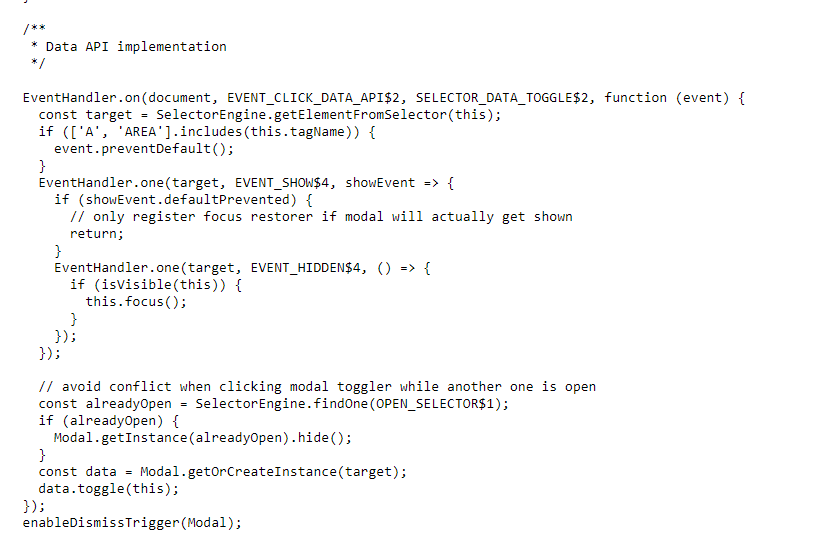

# Day5 - 使用指令建立 Composables 題目



請 clone 這一份模板，完成以下條件 :

- 在 pages/index.vue 使用 ES6 fetch 或是 axios 串接前台 [最新消息 API ( GET )](https://nuxr3.zeabur.app/swagger/#/Home%2FNews%20-%20%E6%9C%80%E6%96%B0%E6%B6%88%E6%81%AF) ，將資料寫入 newsList 並且切換 Loading 元件開啟、關閉的狀態。
- 將 newsList 資料在 <NewsCard  /> 以 v-for 渲染卡片，並將 props 傳入<NewsCard  /> 元件
- **將資料和 API 的方法移至 composables/useHome.js ，改成使用 composable 引入方法與資料**

## 安裝

以下將會引導你如何安裝此專案到你的電腦上。

Node.js 版本建議為：`18.0.0` 以上

### 取得專案

```bash
git clone -b day5-composable  https://github.com/jasonlu0525/nuxt3-live-question.git day5-composable
```

### 移動到專案內

```bash
cd day5-composable
```

### 安裝套件

```bash
npm install
```

### 運行專案

```bash
npm run dev
```

### 開啟專案

在瀏覽器網址列輸入以下即可看到畫面

```bash
http://localhost:3000/
```
